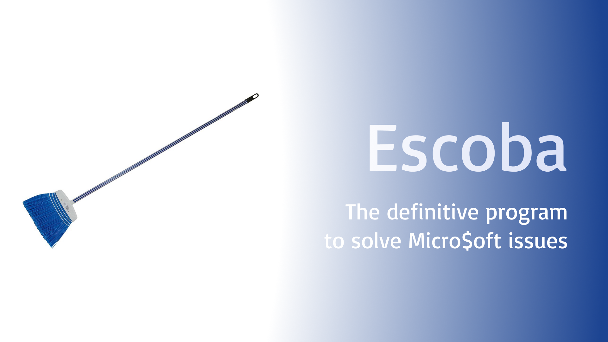

Escoba is the definitive broom for your day-to-day, you can save up to 80% of RAM by just using whatever is this program, without closing any program or tab in your browser!

## Downloads

You can download Escoba from [releases](https://github.com/gatomod/escoba/releases).

## Why?

**TL;DR:** Windows sucks.

Windows has a terrible memory management, it seems that it doesn't allocate space efficiently. If you have 64 GB of RAM that doesn't care (and if you run out of memory just buy another 64 GB) but in a computer with low resources having the worst memory allocator feels like a kick in the balls.

I discovered this while I was bored in class, and I named it escoba (broom in Spanish) because it literally cleans the RAM like a broom sweeping a dirty floor.

## How it works?

Escoba has an advanced complex AI algorithm that pushes useless data into a vector until the RAM is full of garbage and forces Windows to compress and optimize all existing allocations. Once RAM is properly optimized, Escoba closes by failed memory allocation.

This doesn't work on other OS (like Linux) because unlike Window$, memory allocators are well designed.

## Comparison

Escoba is better than CCleaner in all aspects. Just see this table to see the benefits of using Escoba over CCleaner:

|                          | Escoba | CCleaner |
| ------------------------ | ------ | -------- |
| Efficient memory clean   | ✅      | ❌        |
| Open source              | ✅      | ❌        |
| Secure                   | ✅      | ❌        |
| Simple                   | ✅      | ❌        |
| Free without ads         | ✅      | ❌        |
| Is a broom               | ✅🧹     | ❌        |
| Has annoying banners     | ❌      | ✅        |
| Removes critical files   | ❌      | ✅        |
| Boilerplate              | ❌      | ✅        |
| Is a spy Chinese balloon | ❌      | ✅🎈       |

Definitively CCleaner is holy trash, Escoba has 7291 useful features that anyone can use easily.

## Showcase

These screenshots show the unlimited power of Escoba. Thanks to [tnfAngel](https://github.com/tnfangel) for testing and sharing the screenshots!

Before Escoba execution, RAM usage was 43 GB. After a minute, RAM usage was 14 GB, that's 29 GB saved what the fuck is wrong with Micro$oft engineers? Sure they stole the allocator to someone like most of their products.
Before Escoba execution, RAM usage was 43 GB. After a minute, RAM usage was 14 GB, that's 29 GB saved.
Escoba also helps the CPU by underclocking your CPU to 0 GHz

## Disclaimer

This is a useless repository with a weird program made just for fun. It surprisingly works, but it's not my intention to insult or promote hate. **Just don't take it seriously and enjoy it!**

## License

Escoba is licensed under the [3-Clause BSD License](https://opensource.org/license/bsd-3-clause).

## Contribute

Any PR is welcome! Escoba is a small project, so please follow the code style and avoid making insane proposals.

*Gátomo - The 3-Clause BSD License*
